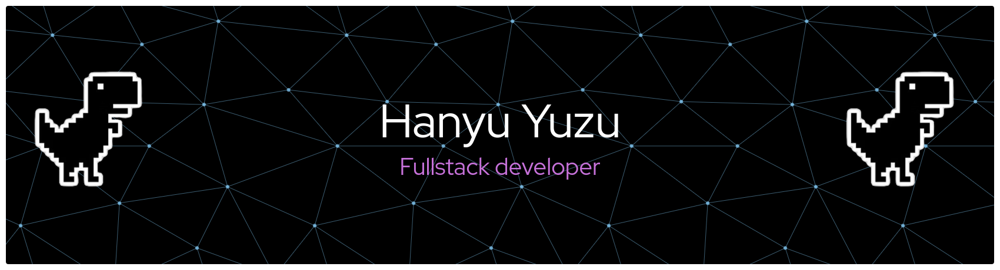

```text
                   -`                    hanyu@arch
                  .o+`                   ----------
                 `ooo/                   OS: Arch Linux x86_64
                `+oooo:                  Host: P2540UA (1.0)
               `+oooooo:                 Kernel: Linux 6.18.9-arch1-2
               -+oooooo+:                Uptime: 17 hours, 19 mins
             `/:-:++oooo+:               Packages: 1623 (pacman)
            `/++++/+++++++:              Shell: zsh 5.9
           `/++++++++++++++:             WM: Hyprland (Wayland)
          `/+++ooooooooooooo/`           Terminal: kitty 0.45.0
         ./ooosssso++osssssso+`          CPU: Intel i5-7200U (4) @ 3.10GHz
        .oossssso-````/ossssss+`         GPU: Intel HD Graphics 620
       -osssssso.      :ssssssso.        Memory: 16GB RAM
      :osssssss/        osssso+++.       Status: Open to Opportunities 🚀
     /ossssssss/        +ssssooo/-
   `/ossssso+/:-        -:/+osssso+-
  `+sso+:-`                `.-/+oso:
 `++:.                            `-/+/
 .`                                 `/
```

# hanyu@arch:~$ whoami



<h1 align="center">Kumusta, I'm Yohan 👋</h1>

<p align="center">
  Full-stack and cross-platform developer from Bukidnon, Philippines.<br>
  I turn real operational workflows into practical, maintainable software.
</p>

<p align="center">
  <a href="https://nuxpower.github.io/myweb/"></a>
  <a href="https://www.linkedin.com/in/yohan-lukin-callanta"></a>
  <a href="mailto:hanyunikul@gmail.com"></a>
</p>

## About me

I'm a BS Information Technology graduate specializing in software development. My work spans agricultural platforms, government inventory and HR systems, payroll tools, marketplaces, and mobile booking applications.

- Built full-stack products with **Laravel, Vue, PostgreSQL, and Docker**
- Developed cross-platform applications with **Flutter, Firebase, and Capacitor**
- Maintained and integrated legacy government systems during my internship at **DepEd Regional Office 10**
- Most interested in **workflow automation, API integration, reliable data, and role-based systems**
- Daily-driving **Arch Linux, Hyprland, Neovim, and Zsh**

## Additional training

- **AWS Academy Cloud Foundations** — completed
- **AWS Academy Cloud Security Foundations** — completed

## Selected work

| Project | What I built | Stack |
| --- | --- | --- |
| [AniBukid](https://github.com/NuxPower/farm_operation_management) | A rice-farm operations and marketplace platform with GPS field mapping, crop lifecycle tracking, weather-informed alerts, labor and inventory workflows, reporting, and post-harvest processing. | Laravel, Vue, PostgreSQL, Docker |
| **ROX Inventory 2.0** | Maintained and extended a government asset-management system, working on role-based access, reporting, QR workflows, API integration, and legacy PHP modernization. | Laravel, Sximo, MySQL, REST APIs |
| [KLEMA](https://github.com/NuxPower/sia-project) | A climate-smart agriculture platform with interactive farm maps, forecast caching, scheduled weather alerts, and Android/iOS delivery. | Laravel, Vue, PostgreSQL, Capacitor |
| [AgriTrade](https://github.com/NuxPower/agritrade) | Backend APIs for a role-based agricultural marketplace covering products, carts, orders, payouts, promo codes, and farmer verification. | NestJS, PostgreSQL, JWT |

You can also explore my [BusTrak mobile app](https://github.com/NuxPower/bustrak), [Iron Lifters gym system](https://github.com/NuxPower/Iron-Lifters), and [full portfolio](https://nuxpower.github.io/myweb/). Some professional and client work is kept private.

## Toolbox

**Backend**


**Frontend & mobile**


**Data, cloud & tools**


## How I like to work

I enjoy understanding the real process behind a system before writing code—who uses it, which data matters, where failures happen, and what can be automated. That has led me to work comfortably across new product development, API and database integration, technical support, and established legacy codebases.

When I'm away from application code, I'm usually tuning my [dotfiles](https://github.com/NuxPower/dotfiles), learning more about Linux and infrastructure, repairing hardware, or playing Dota 2, Valorant, and Assetto Corsa.

---

<p align="center">
  <em>Have a project or opportunity in mind? Let's build something useful.</em>
</p>

<p align="center">
  
</p>

<p align="center">
  
</p>

<p align="center">
  <a href="https://git.io/streak-stats">
    
  </a>
</p>

<picture>
  <source media="(prefers-color-scheme: dark)" srcset="https://raw.githubusercontent.com/NuxPower/NuxPower/output/github-contribution-grid-snake-dark.svg">
  <source media="(prefers-color-scheme: light)" srcset="https://raw.githubusercontent.com/NuxPower/NuxPower/output/github-contribution-grid-snake.svg">
  
</picture>

<p align="center">
  
</p>

<p align="center">
  
</p>
